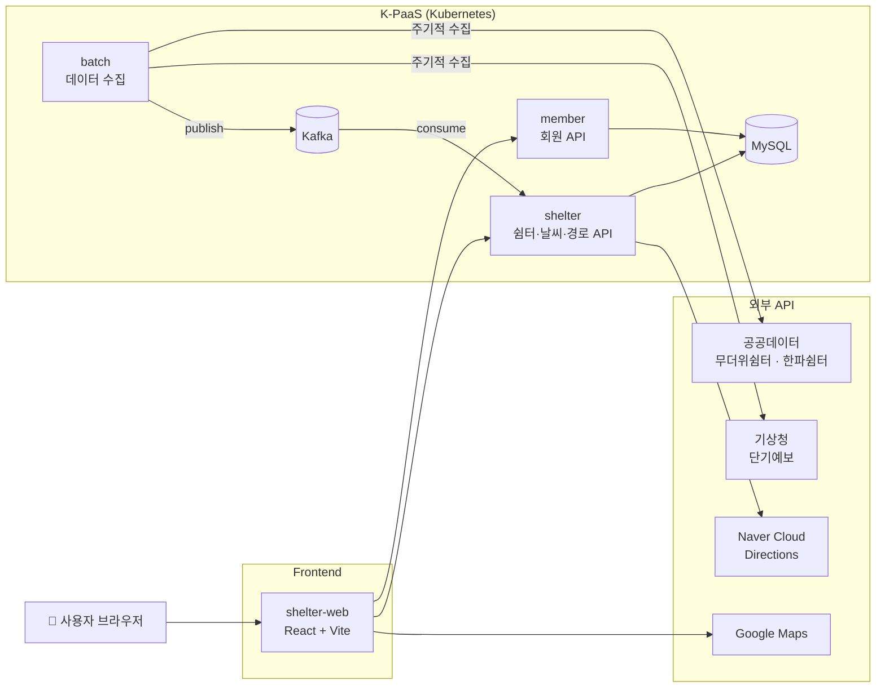

<div align="center">


# 안심쉼터

**폭염·한파 속, 내 주변 가장 가까운 쉼터를 찾아주는 위치 기반 웹 서비스**

<!-- 배포 링크가 있다면 아래 주석을 해제하고 주소를 넣어주세요 -->
<!-- [🔗 서비스 바로가기](https://배포-주소) -->


</div>

<br />

## 📌 프로젝트 소개

여름철 폭염과 겨울철 한파는 고령자, 야외 노동자 등 취약계층에게 직접적인 위협이 됩니다.
전국에 무더위쉼터와 한파쉼터가 운영되고 있지만, **"지금 내 근처 어디에 있는지"** 를 바로 알기는 어렵습니다.

**안심쉼터**는 사용자의 현재 위치를 기반으로

- 계절에 맞는 **주변 쉼터(무더위쉼터 / 한파쉼터)** 를 가까운 순으로 보여주고,
- 쉼터의 **운영 시간·수용 인원·냉난방기 현황** 같은 상세 정보를 제공하며,
- 쉼터까지의 **경로와 소요 시간** 을 안내하는 모바일 우선 웹 서비스입니다.

- **개발 기간** : 2025.09 ~ 2025.10
- **레포지토리** : 이 저장소는 안심쉼터의 **웹 프론트엔드** 입니다. 백엔드·인프라는 [K-PaaS-Team22](https://github.com/K-PaaS-Team22) 조직에서 확인할 수 있습니다.

<br />

## 🎬 시연

<!-- 시연 영상(mp4)은 GitHub 편집 화면에 파일을 드래그하면 업로드 링크가 생성됩니다. -->
<!-- 스크린샷은 아래 표의 이미지 주소를 교체해서 사용하세요. -->


https://github.com/user-attachments/assets/6d01cc99-4ba6-4f71-bdd1-4f8496264632

<br />

## ✨ 주요 기능

### 1. 계절별 주변 쉼터 찾기

- 브라우저 Geolocation으로 현재 위치를 가져와 지도에 표시합니다. (정확도 반경 원 표시)
- 접속 시점의 월을 기준으로 **4~10월에는 무더위쉼터, 11~3월에는 한파쉼터** 를 자동으로 조회합니다.
- 조회된 쉼터는 바텀시트에 **거리순 리스트** 로 표시되며, 스크롤 시 추가로 불러옵니다.
- `내 위치` 버튼으로 언제든 현재 위치로 지도를 되돌릴 수 있습니다.

### 2. 오늘의 날씨

- 현재 위치 기준 기온, 하늘 상태, 강수 확률·형태, 강수량, 풍향·풍속 등을 보여줍니다.
- 하늘 상태(SKY)와 강수 형태(PTY) 코드에 맞춰 7종의 날씨 아이콘을 표시합니다.

### 3. 쉼터 상세 정보

- 쉼터 위치를 커스텀 마커로 지도에 표시합니다.
- 최대 수용 인원, 평일·주말 운영 시간, 숙박 가능 여부, 가동 중인 냉난방기 수, 건물 면적, 쉼터 번호를 제공합니다.
- 공공데이터의 딱딱한 필드를 `"최대 50명까지 수용 가능해요."` 처럼 읽기 쉬운 문장으로 바꿔 보여줍니다.

### 4. 쉼터까지 경로 안내

- 상세 페이지의 `경로 보기` 를 누르면 현재 위치에서 쉼터까지의 경로를 지도에 그립니다.
- 출발·도착 마커와 경로 폴리라인을 표시하고, 출발~도착이 한 화면에 들어오도록 지도 범위를 자동으로 맞춥니다.
- 바텀시트에서 **총 소요 시간·총 거리** 와 **구간별 길 안내** 를 확인할 수 있습니다.
- 목적지를 URL 파라미터로 관리하여 **새로고침해도 경로가 유지** 됩니다.

### 5. 회원 기능

- 로그인 / 회원가입 (React Hook Form + Zod 입력값 검증)
- 세션이 남아 있으면 자동 로그인 후 지도 화면으로 이동
- `로그인 없이 둘러보기` 로 비회원도 모든 조회 기능을 사용할 수 있습니다.

### 6. 위치 권한 오류 대응

- 위치 권한 거부 / 위치 신호 없음 / 시간 초과 상황을 구분해 안내 모달을 띄웁니다.
- 권한 거부 시에는 Chrome·Safari별 권한 허용 방법을 안내합니다.
- 권한 거부처럼 재시도해도 소용없는 오류는 재시도하지 않고, 일시적인 오류만 지수 백오프로 재시도합니다.

<br />

## 🛠 기술 스택

| 분류 | 기술 |
| --- | --- |
| **Core** | React 19, TypeScript 5.8, Vite 7 |
| **Routing** | React Router 7 |
| **Server State** | TanStack Query 5, Axios |
| **Client State** | Zustand 5 (모달·바텀시트 전역 상태) |
| **Form** | React Hook Form, Zod |
| **Map** | Google Maps JavaScript API (`@react-google-maps/api`) |
| **Styling** | CSS Modules, Pretendard (서브셋 폰트), react-icons |
| **Code Quality** | ESLint, Prettier |
| **Deploy** | Vercel, Docker + Nginx (K-PaaS) |
| **CI/CD** | GitHub Actions (GitLab 미러링, 포크 저장소 동기화) |

<br />

## 🏗 시스템 아키텍처



- **batch** 서버가 공공 API에서 쉼터·날씨 데이터를 주기적으로 수집해 Kafka로 전달하고, **shelter** 서버가 이를 받아 DB에 저장합니다.
- 프론트엔드는 **shelter** 서버에서 주변 쉼터·날씨·경로를, **member** 서버에서 회원 정보를 조회합니다.

<br />

## 🔌 사용 API

| 기능 | Method | Endpoint | 설명 |
| --- | --- | --- | --- |
| 주변 무더위쉼터 | `GET` | `/api/shelter/summer/near` | 현재 좌표(`userLat`, `userLot`) 기준 거리순 조회 |
| 주변 한파쉼터 | `GET` | `/api/shelter/winter/near` | 현재 좌표 기준 거리순 조회 |
| 오늘의 날씨 | `GET` | `/api/weather/today` | 현재 좌표 기준 단기예보 |
| 경로 조회 | `GET` | `/api/route/path` | `startLat`, `startLot`, `goalLat`, `goalLot` |
| 회원가입 | `POST` | `/save` | member 서버 |
| 로그인 | `POST` | `/login` | member 서버 (쿠키 세션) |
| 로그인 확인 | `GET` | `/info` | 자동 로그인에 사용 |

<br />

## ⚡ 성능 최적화

Lighthouse 측정 결과 FCP·LCP 지표가 낮게 나와, 초기 로딩 성능을 중심으로 개선했습니다.
(`pnpm preview` 프로덕션 빌드 환경에서 지도 페이지 기준 측정)

| 지표 | Before | After | 개선 |
| --- | :---: | :---: | :---: |
| **Performance Score** | 74 | **94** | +20점 |
| FCP | 1.9s | **0.4s** | 1.5초 단축 |
| LCP | 2.8s | **1.4s** | 1.4초 단축 |
| Speed Index | 1.9s | **1.4s** | 0.5초 단축 |
| 메인 JS 번들 (gzip) | 166.07KB | **56.85KB** | 약 66% 감소 |
| 로고 SVG | 2.7MB | **222KB** | 약 91.8% 감소 |
| 폰트 | 2,058KB | **236KB** | 약 88.5% 감소 |

**무엇을 했나요?**

1. **코드 스플리팅** : `React.lazy` + `Suspense` 로 페이지 단위 동적 로딩, Vite `manualChunks` 로 React / Google Maps / react-icons / Query·Form 라이브러리를 별도 청크로 분리
2. **폰트 서브셋** : Pretendard 가변 폰트를 한글 2,350자 + 영문·숫자만 남기도록 서브셋 처리하고 `preload` 적용
3. **이미지 최적화** : 번들에 포함되던 대용량 로고 SVG를 SVGO로 압축하고 `public/` 으로 이동해 JS 번들에서 제외
4. **리스트 렌더링 최적화** : 쉼터 목록을 처음엔 10개만 렌더링하고 `IntersectionObserver` 로 20개씩 추가 로드, `React.memo` · `useCallback` · `useMemo` 로 불필요한 리렌더링 방지

<br />

## 🧯 트러블 슈팅

<details>
<summary><b>HTTPS 배포 환경에서 API 요청이 차단되는 문제 (Mixed Content)</b></summary>

<br />

- **문제** : HTTPS로 배포된 페이지에서 HTTP API를 호출하면 브라우저 보안 정책에 의해 요청이 차단됨
- **해결** : `index.html` 에 `<meta http-equiv="Content-Security-Policy" content="upgrade-insecure-requests" />` 를 추가해 HTTP 요청을 HTTPS로 자동 업그레이드

</details>

<details>
<summary><b>첫 진입 시 바텀시트가 보이지 않는 문제</b></summary>

<br />

- **문제** : 지도 스크립트가 로드되기 전에 `Map` 컴포넌트가 조기 반환되어, 바텀시트가 마운트되기 전에 `setContent` 가 호출되고 무시됨
- **해결** : 지도(`GoogleMap`)만 조건부로 렌더링하고 바텀시트는 항상 마운트되도록 구조 변경, 첫 진입 시 빈 리스트를 한 번 노출하는 로직을 별도 effect로 분리

</details>

<details>
<summary><b>새로고침하면 경로 정보가 사라지는 문제</b></summary>

<br />

- **문제** : 목적지를 Zustand 스토어(메모리)에 저장해, 새로고침 시 상태가 초기화됨
- **해결** : 목적지 좌표를 URL 쿼리 파라미터(`/map?destLat=...&destLng=...`)로 관리하도록 변경

</details>

<details>
<summary><b>쉼터 상세 페이지에서 지도 좌표 오류</b></summary>

<br />

- **문제** : `InvalidValueError: setPosition: not a LatLng` 오류 발생. 코드에서는 `LAT/LOT` 필드를 사용했지만 실제 API 스키마는 `LA/LO` 였고, 좌표가 문자열로 내려오는 경우도 있었음
- **해결** : 필드명을 스키마에 맞게 수정하고 문자열 좌표를 숫자로 변환, 유효하지 않은 좌표는 안내 문구로 처리

</details>

<details>
<summary><b>Vercel 배포 후 새로고침 시 404</b></summary>

<br />

- **문제** : SPA 라우팅 경로(`/map`, `/detail`)에서 새로고침하면 서버에 해당 파일이 없어 404 발생
- **해결** : `vercel.json` 에 모든 경로를 `/` 로 보내는 rewrite 설정 추가 (Nginx 배포 시에는 `try_files` 로 동일하게 처리)

</details>

<br />

## 📁 폴더 구조

기능(feature) 단위로 폴더를 나누고, 각 기능 안에서 UI(`components`)와 로직(`hooks`, `services`, `utils`)을 분리했습니다.

```
src
├── assets/icon          # 날씨 아이콘
├── common
│   ├── components       # Button, Input, Header, Modal, BottomSheet
│   ├── hooks            # 모달·바텀시트 전역 스토어, 바텀시트 드래그 인터랙션
│   └── utils            # API URL 생성, Axios 에러 메시지 처리
├── features
│   ├── map              # 메인 지도, 현재 위치, 날씨
│   ├── shelter          # 주변 쉼터 조회, 쉼터 리스트
│   ├── shelter-detail   # 쉼터 상세 페이지
│   ├── route            # 경로 조회, 경로 표시, 길 안내
│   └── user             # 로그인, 회원가입, 자동 로그인
├── shared/services/apis # member 서버 Axios 인스턴스
├── App.tsx              # 라우팅, React Query Provider
└── main.tsx
```

| 경로 | 화면 |
| --- | --- |
| `/` | 로그인 |
| `/signup` | 회원가입 |
| `/map` | 메인 지도 (주변 쉼터 · 날씨 · 경로) |
| `/detail` | 쉼터 상세 |

<br />

## 🚀 시작하기

### 요구 사항

- Node.js 20+
- pnpm

### 설치 및 실행

```bash
git clone https://github.com/K-PaaS-Team22/shelter-web.git
cd shelter-web
pnpm install
pnpm dev
```

### 환경 변수

프로젝트 루트에 `.env` 파일을 만들고 아래 값을 채워주세요.

```env
# Google Maps JavaScript API 키
VITE_GOOGLE_MAPS_API_KEY=

# 회원(member) 서버 주소
VITE_MEMBER_API_URL=

# 쉼터(shelter) 서버 주소
# - 개발 환경: Vite 프록시 대상 (/shelter, /weather, /route → /api/*)
# - 배포 환경: VITE_API_BASE_URL이 없을 때 fallback
VITE_PROXY_TARGET=

# 배포 환경 쉼터 서버 주소 (선택)
VITE_API_BASE_URL=
```

### 스크립트

| 명령어 | 설명 |
| --- | --- |
| `pnpm dev` | 개발 서버 실행 |
| `pnpm build` | 타입 체크 후 프로덕션 빌드 |
| `pnpm preview` | 빌드 결과물 미리보기 |
| `pnpm lint` | ESLint 검사 |

### Docker로 실행

```bash
docker build \
  --build-arg VITE_API_BASE_URL=<쉼터 서버 주소> \
  --build-arg VITE_MEMBER_API_URL=<회원 서버 주소> \
  --build-arg VITE_GOOGLE_MAPS_API_KEY=<구글 맵 API 키> \
  -t shelter-web .

docker run -p 8080:80 shelter-web
```

멀티 스테이지 빌드로 Node에서 정적 파일을 빌드한 뒤 Nginx로 서빙합니다. (`/healthz` 헬스 체크 엔드포인트 제공)

<br />


## 🔗 관련 레포지토리

| 레포지토리 | 설명 |
| --- | --- |
| [shelter-web](https://github.com/K-PaaS-Team22/shelter-web) | 웹 프론트엔드 (현재 레포) |
| [shelter](https://github.com/K-PaaS-Team22/shelter) | 쉼터·날씨·경로 API 서버 (Spring Boot) |
| [member](https://github.com/K-PaaS-Team22/member) | 회원 API 서버 (Spring Boot) |
| [batch](https://github.com/K-PaaS-Team22/batch) | 공공데이터 수집 배치 서버 (Spring Batch, Kafka) |
| [Cloud](https://github.com/K-PaaS-Team22/Cloud) | K-PaaS 배포 설정 (Kubernetes, Kafka, MySQL, Jenkins) |
